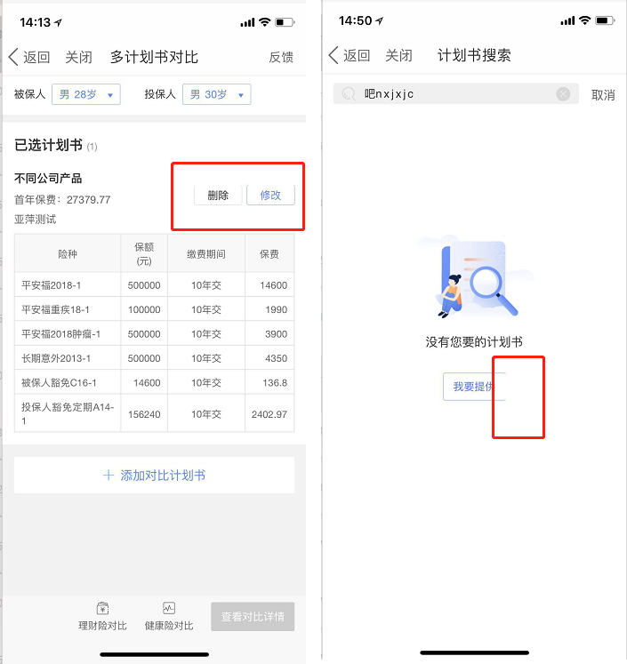

#### 1像素边框显示不全  
移动端1像素边框问题：
设置边框为 1px solid #000; 实际表现却是边框线是模糊的，或者是大于1px的。原因是：不同手机物理像素不同，对应的设备像素比不同，同样的1pxcss像素，转换成物理像素后，尺寸是不同的，所以导致了显示的差异。
1px边框有以下几种方式实现：
* border: .5px solid #000;
* 阴影box-shadow
* 边框背景图片：border-image
* 整个元素使用带边框的背景图片
* 转换中的缩放 scale
* 利用JS根据window.devicePixelRatio分别进行判断修改根节点的fontSize，其他元素以rem为单位

其中边框设为0.5px缺点是，有时候边框显示不全（如图）。  

**原因**：  未确定。  
**解决方法**：  
1. 上边框被遮住，样式中有 { position: absolute； top：50% },可以尝试把改成 top: 51%.  
2. 尽量不要使用display: inline-block，改用display: block。  

**相关链接**：  
[移动web 1像素边框 瞧瞧大公司是怎么做的](https://segmentfault.com/a/1190000007604842)

