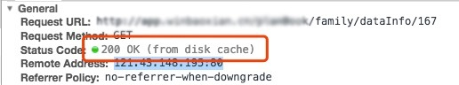

#### 页面回退不刷新
A页面跳转B页面，再回退到A页面，A页面不刷新

**原因**：

1. B页面回退到A页面，移动端部分浏览器 (如iphoneX) 默认不执行更新操作。
2. B页面回退到A页面，执行了更新操作。但ajax请求从本地缓存中读取数据，导致页面数据不更新。
    
3. 在app中跳转B页面，新开了窗口(类似于浏览器中新开了标签页)

**解决**：

1. 调用pageshow事件，强制刷新。代码如下：
    ```
    var isPageHide = false
    window.addEventListener('pageshow', function () {
        isPageHide && window.location.reload()
    })
    window.addEventListener('pagehide', function () {
        isPageHide = true
    })
    ```

2. 请求接口地址加上时间戳。如上接口地址，改为：'.../family/dataInfo/167?v=' + new Date().getTime()
3. 在app中新开窗口，需要原生提拱回退监听事件(A页面监听回退，执行刷新)


